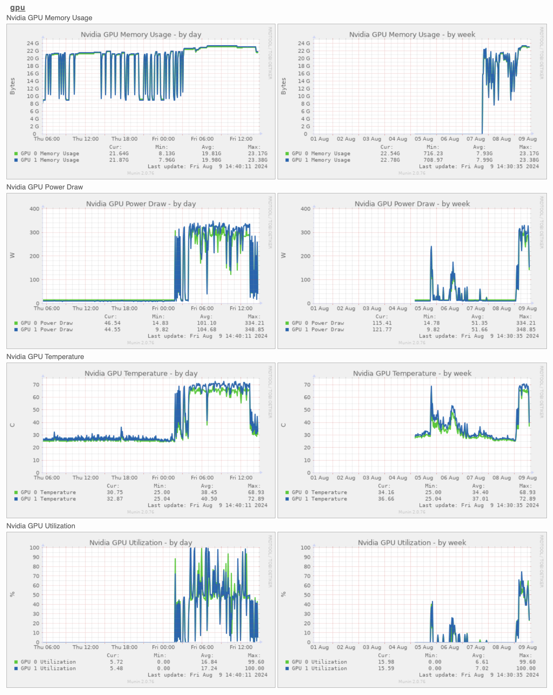

# NVIDIA GPU Munin Plugin

This plugin offers a modern & simple solution for monitoring multiple GPUs in a Linux environment using only Python 3 and nvidia-smi, without any additional dependencies, for free under the MIT License. The aim is to provide an efficient, easy-to-use, straightforward tool for fellow enthusiasts and system administrators who may already have a Munin installation.

After exploring options in the [munin-contrib](https://github.com/munin-monitoring/contrib/tree/master/plugins/gpu) repository, I encountered issues with the nvidia::ml Perl library dependencies. Additionally, a bash version printed 0s for all values while sending bash parse errors to stderr. These challenges led me to develop this Python-based plugin.

Let's get those GPUs monitored! 🚀 🖥️

## Overview

This Munin plugin monitors NVIDIA GPU statistics, providing valuable insights into GPU performance and resource utilization. It captures and graphs the following metrics for each detected NVIDIA GPU:

- Memory Usage (Bytes)
- Temperature (°C)
- Power Draw (W)
- GPU Utilization (%)

The plugin uses the `nvidia-smi` command-line tool to gather this information, making it compatible with systems that have NVIDIA GPUs and the necessary drivers installed.



## Features

- Multi-GPU support
- Real-time monitoring of key GPU metrics
- Easy integration with Munin monitoring system
- Configurable graph generation

## Requirements

- Python 3 (no additional modules required)
- NVIDIA GPU(s)
- NVIDIA drivers and `nvidia-smi` utility installed
- Munin node

## Installation

1. Clone this repository or download the `nvidia_gpu` file.

2. Make the script executable:
   ```
   chmod +x nvidia_gpu
   ```

3. Copy the script to your Munin plugins directory (typically `/usr/share/munin/plugins/` or `/etc/munin/plugins/`):
   ```
   sudo cp -a nvidia_gpu /usr/share/munin/plugins/nvidia_gpu
   ```

4. Create a symlink in the Munin node plugins directory:
   ```
   sudo ln -s /usr/share/munin/plugins/nvidia_gpu /etc/munin/plugins/nvidia_gpu
   ```

5. Restart the Munin node:
   ```
   sudo service munin-node restart
   ```

## Configuration

The plugin should work out of the box for most setups. However, if you need to adjust any settings, you can create a configuration file in `/etc/munin/plugin-conf.d/`:

```
[nvidia_gpu]
user root
env.NVIDIA_SMI /usr/bin/nvidia-smi
```

Adjust the `user` and `env.NVIDIA_SMI` variables as needed for your system.

## Usage

Once installed and configured, the plugin will automatically run at Munin's regular intervals (typically every 5 minutes). You can test the plugin manually by running:

```
munin-run nvidia_gpu
```

To see the configuration output:

```
munin-run nvidia_gpu config
```

## Troubleshooting

If you encounter any issues:

1. Ensure `nvidia-smi` is installed and functioning correctly.
2. Check that the plugin has the necessary permissions to run.
3. Verify that the Munin node can execute the plugin.
4. Check Munin logs for any error messages.

## Contributing

Contributions are welcome! Please feel free to submit a Pull Request.

## License

This project is licensed under the MIT License - see the [LICENSE](LICENSE) file for details.

## Acknowledgments

- Thanks to the NVIDIA team for providing the `nvidia-smi` tool.
- Inspired by various Munin plugins in the community.

## Author

(c) 2024 Joe Presbrey

## Version History

- 1.1.0
  - Updated memory usage reporting from MiB to Bytes for improved precision
- 1.0.0
  - Initial release
  - Basic monitoring of memory usage, temperature, power draw, and GPU utilization

---

For more information on Munin plugins, visit the [Munin Plugin Documentation](https://guide.munin-monitoring.org/en/latest/plugin/index.html).
